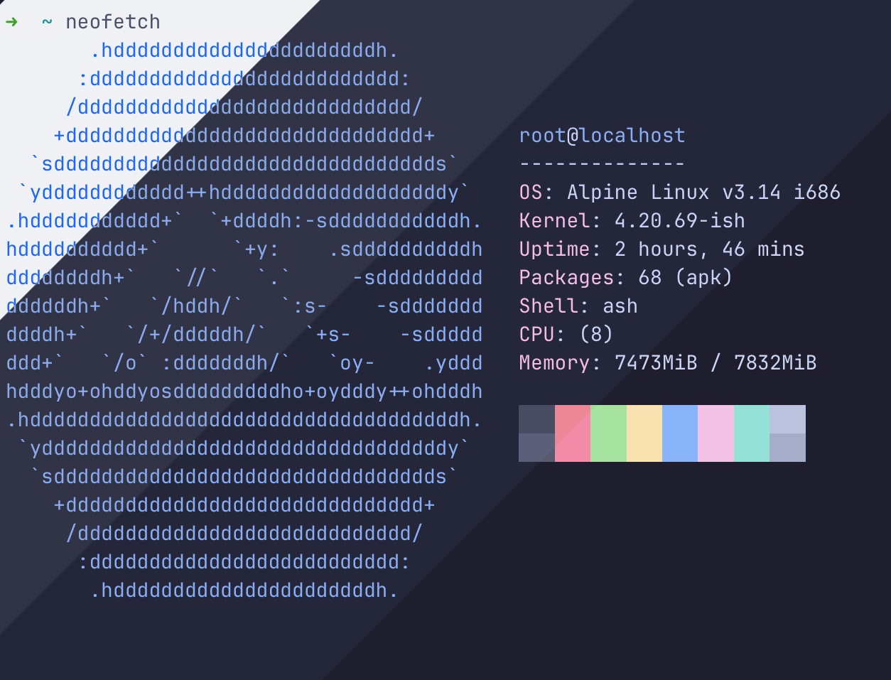
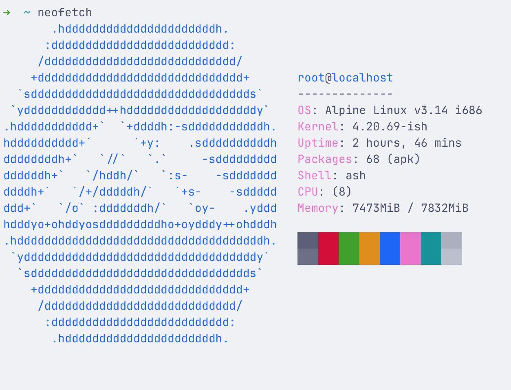
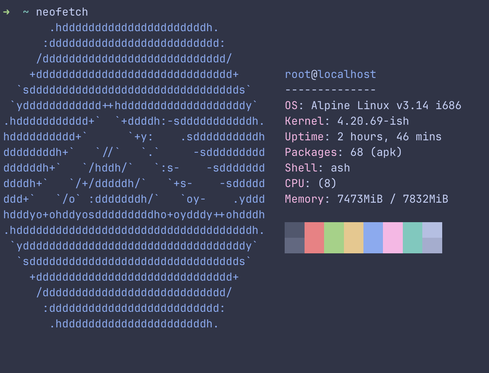
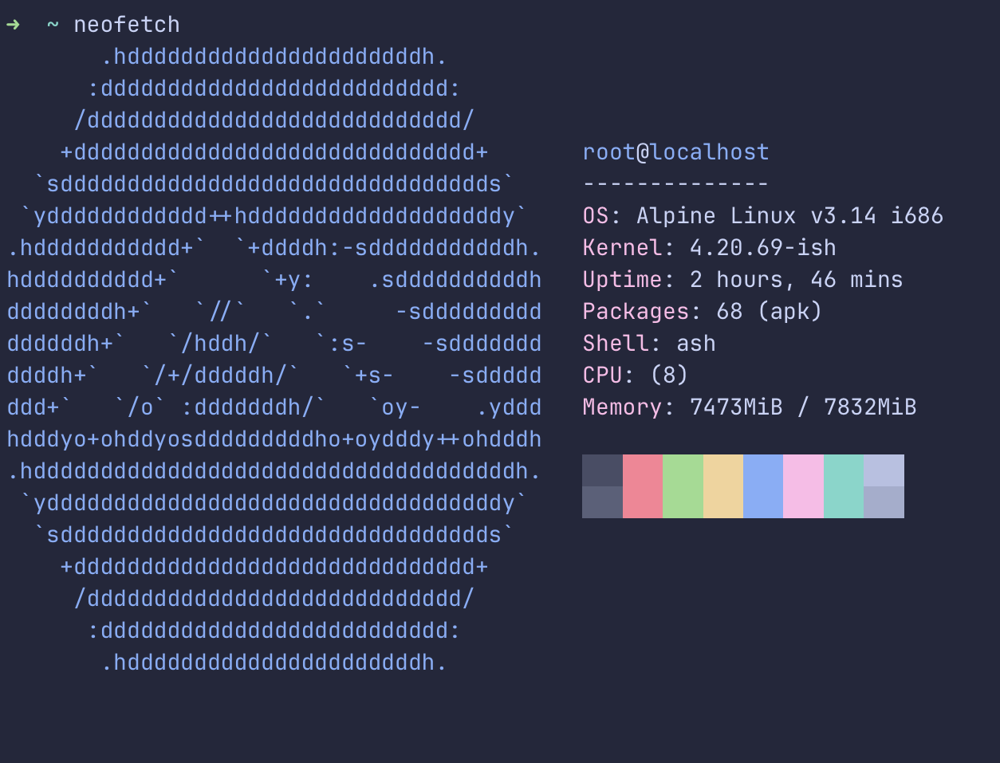
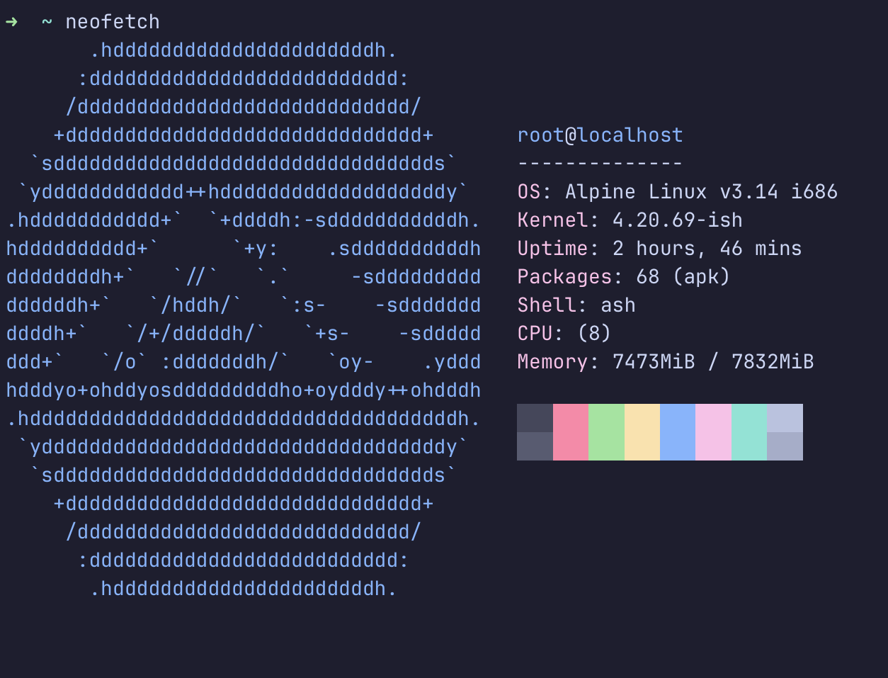

<h3 align="center">
	 
	
	Catppuccin for <a href="https://github.com/ish-app/ish">iSH</a>
	
</h3>

	
	
	

	

## Previews

🌻 Latte

🪴 Frappé

🌺 Macchiato

🌿 Mocha

## Usage

1. Save the chosen theme to your device.
2. Open the app's settings
3. Select `Appearance > Theme > Edit > Import Theme`
4. Locate the file on your device
5. Click the `Done` button and select the desired theme

&nbsp;

	

	Copyright &copy; 2021-present <a href="https://github.com/catppuccin" target="_blank">Catppuccin Org</a>

	

